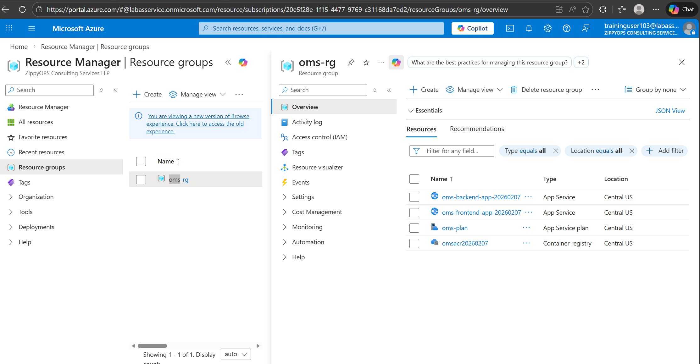

# Order Management System

A full-stack **Order Management System** built using **Spring Boot** (backend) and **Angular** (frontend).  
The application is containerized with **Docker** and deployed on **Microsoft Azure**.

---

## Tech Stack

- **Backend:** Java, Spring Boot, Spring Security, JPA, MySQL  
- **Frontend:** Angular, TypeScript, HTML, CSS  
- **DevOps & Cloud:** Docker, Microsoft Azure  

---

## About the Project

This project allows users to log in, view products, place orders, and track order details through a clean and interactive dashboard.  
The backend exposes REST APIs, while the frontend consumes these APIs to provide a smooth user experience.

The entire application is containerized using Docker and deployed on Azure, demonstrating real-world deployment practices.

---

## Project Overview

- User authentication and login
- Dashboard for quick overview
- Product management
- Order management
- Dockerized application
- Deployed on Microsoft Azure

---

## Screenshots

### Login Page

### Dashboard

### Products Page

### Orders Page

---

## Docker & Cloud Deployment

### Docker Image

### Docker Container Running

### Azure Deployment

### Azure Connection

---

## How to Run

### Backend
- Open the `backend` folder in Eclipse or IntelliJ
- Configure database details
- Run as a Spring Boot application

### Frontend
- Open the `frontend` folder in VS Code
- Run `npm install`
- Start the app using `ng serve`
---
## Project Presentation
[View Project PPT](presentation/Order-Management-System-Presentation.pptx)

---

## Author

**CHALLA PINTU**

---

## Note

This project is developed for learning and demonstration purposes, focusing on full-stack development, Docker containerization, and Azure deployment.
